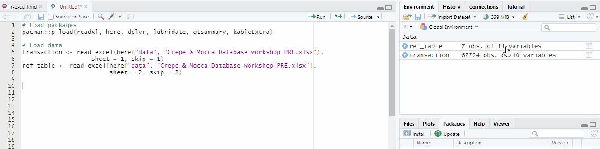
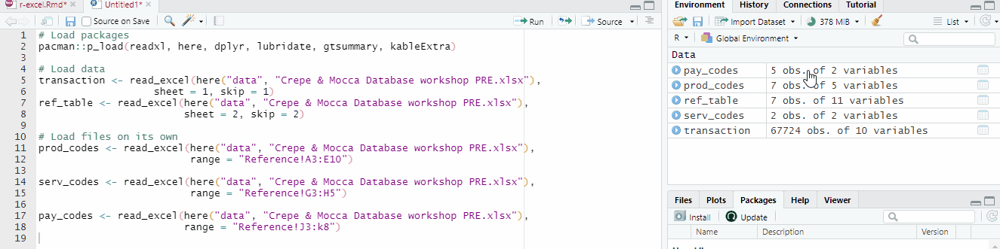
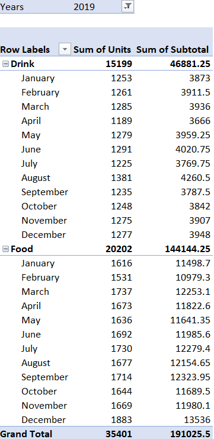
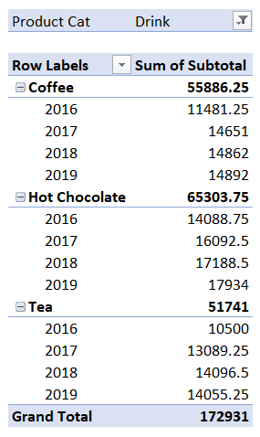
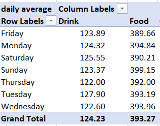

```{css, echo=FALSE}
# CSS for including pauses in printed PDF output (see bottom of lecture)
@media print {
  .has-continuation {
    display: block !important;
  }
}
```

```{r setup, include=FALSE}
options(htmltools.dir.version = FALSE)
library(knitr)
opts_chunk$set(
  fig.align="center",  
  fig.height=4, #fig.width=6,
  # out.width="748px", #out.length="520.75px",
  dpi=300, #fig.path='Figs/',
  cache=T#, echo=F, warning=F, message=F
  )
library(tidyverse)
library(hrbrthemes)
library(fontawesome)
```


# Workshop preparation

☑ Download MFRE Data Workshop 1 Folder

☑ Open `Workshop 1.RProj` in RStudio

☑ Then go to `Code` folder and open up `r_for_excel.Rmd` 

---

class: inverse, center, middle
name: motivation

# Motivation

<html><div style='float:left'></div><hr color='#EB811B' size=1px width=796px></html>

---

# Why this Workshop?

Excel is a powerful tool, but as data gets bigger, you may need more tools.

- How do you analyze data that won't open up in Excel because the file is too large?
- How do you work with data that are stored in different Excel files?
- How do you replicate your work if your boss/colleague sends you new files?
- Etc.

---

# Learning Outcomes

- Differentiate tidy data from clean data
- Explain the importance of tidy data and clean data in data analysis
- Identify errors in the data and propose possible solutions to address these errors
- Create report-quality graphs and tables

---
class: inverse, center, middle
name: get_started

# Getting Started

<html><div style='float:left'></div><hr color='#EB811B' size=1px width=796px></html>

---

# Load Packages and Data

```{r loadpackages, message = FALSE}
pacman::p_load(readxl, here, dplyr, lubridate, 
               kableExtra, janitor, skimr, tidyr)

transaction <- read_excel(here("data", "Crepe & Mocca Database workshop PRE.xlsx"), 
                   sheet = 1, skip = 1)
ref_table <- read_excel(here("data", "Crepe & Mocca Database workshop PRE.xlsx"), 
                        sheet = 2, skip = 2)
```

---

# Inspecting the Data

Now let's take a look at the `transaction` data. 

```{r checkdata}
head(transaction)
```

---

# Inspecting the Data

Now let's take a look at the `ref_table` data. 

```{r checkdata_ref}
head(ref_table)
```

---
class: inverse, center, middle
name: motivation

# Tidy Data

<html><div style='float:left'></div><hr color='#EB811B' size=1px width=796px></html>

---

# Tidy Data

<div align="center">

</div>

.footnote[
[1] [Tidy Data for Efficiency, Reproducibility, and Collaboration](https://www.openscapes.org/blog/2020/10/12/tidy-data/) 
]

---

# Why Care about Tidy Data?

- Tidy data arranges values so that the relationships in the data parallel the structure of the data frame. 
- R functions and packages are optimized to work with tidy data

.footnote[
[1] [Data Science with R](https://garrettgman.github.io/tidying/)
]

---

# Tidy Data

- Are both data frames tidy? Why or why not?

---

# Tidy Data

- Are both data frames tidy? Why or why not?
- Most data you will work with in your Graduating Project (GPs) and in life will **not be tidy**

---

# Tidy Data

- Are both data frames tidy? Why or why not?
- Most data you will work with in your Graduating Project (GPs) and in life will **not be tidy**
  - Why? Perhaps that data structure is more conducive for data entry, or that format is the convention in that field. 
    
---

# Tidy Data

- Are both data frames tidy? Why or why not?
- Most data you will work with in your Graduating Project (GPs) and in life will **not be tidy**
  - Why? Perhaps that data structure is more conducive for data entry, or that format is the convention in that field. 
- Be prepared to spend more time tidying your data than doing your analysis for your GP. 
  - The earlier you get your data into a tidy format, the more time you can spend answering interesting questions about your data. 

---

# Inspecting the Data

- Data is *NOT TIDY* for the `ref_table` data
  - Remember that World Development Indicators file Mike showed in FRE526 last Thursday? -> "One variable one column"
- In Excel, this sheet contains 3 separate tables. But R reads it as one big table with empty columns. 
  - Format makes it easy for data entry in Excel but not conducive for data analysis. 



- What can we do to tidy this Reference sheet?

---

# Reload Reference Sheet

- We add the argument `range =` to tell R the cell range to import for each table 
- Since we used `Reference!A3:E10`, we don't have to indicate `sheet = 2` anymore. 

```{r reload_ref_tables}
prod_codes <- read_excel(here("data", "Crepe & Mocca Database workshop PRE.xlsx"), 
                         range = "Reference!A3:E10")

serv_codes <- read_excel(here("data", "Crepe & Mocca Database workshop PRE.xlsx"),
                         range = "Reference!G3:H5")

pay_codes <- read_excel(here("data", "Crepe & Mocca Database workshop PRE.xlsx"), 
                         range = "Reference!J3:k8") 
```



---
class: inverse, center, middle
name: motivation

# Data Cleaning

<html><div style='float:left'></div><hr color='#EB811B' size=1px width=796px></html>

---

# Variable Names

- Do you think that the variable names are conducive for analysis?

```{r colnames}
names(transaction)
names(ref_table)
```

---

# Renaming Variables

In the R bootcamp, we learned two ways to rename variable names

- Method 1
```{r rename_vars1, eval = F}
names(prod_codes)[4] <- "old_price"
names(prod_codes)[5] <- "new_price"
```

- Method 2
```{r rename_vars2, eval = F}
prod_codes <- prod_codes %>%
  rename(old_price = "Price per ea\r\neff. Apr 9, 2015") %>%
  rename(new_price = "Price per ea\r\neff. Oct 10, 2017")
```

---

# Renaming Variables

- There is a package called [`{janitor}`](https://cran.r-project.org/web/packages/janitor/vignettes/janitor.html) that has a very useful `clean_names()` function. 

```{r changenames}
names(prod_codes)

prod_codes <- clean_names(prod_codes)

names(prod_codes)
```

---

# Renaming Variables 

- Let's use the `clean_names()` function on the other data frames too.

```{r changeotherdfnames}
transaction <- clean_names(transaction)
pay_codes <- clean_names(pay_codes)
prod_codes <- clean_names(prod_codes)
serv_codes <- clean_names(serv_codes)
```

- How do your variable names look like now?

---

# Tidy Data versus Clean Data

- Each data frame is now in the tidy format. But can the data be trusted? 
  - Let's look at the `transaction` data frame. 
- What were some data validation steps you did in Janelle's workshop? 

---

# Understanding your data

```{r data_exp}
dim(transaction)
glimpse(transaction)

# skimr::skim(transaction)
```

---

# "Filter" the Variables

- One of the first steps you did in the Excel workshop was to use the filter function

```{r data_exp2}
table(year(transaction$date))
table(month(transaction$date))

table(transaction$service_id)
```

---

# Data Checks - Duplicates

- We can use the [`get.dupes()`](https://www.rdocumentation.org/packages/janitor/versions/2.1.0/topics/get_dupes) function from the `{janitor}` package

```{r duplicates}
duplicates <- transaction %>% 
  get_dupes(invoice_id)

head(duplicates)
```

---

# Data Checks - Duplicates

- Can do additional checks to detect patterns in duplicated `invoice_id`


```{r duplicates_analyze}
table(year(duplicates$date))
table(month(duplicates$date))
```

- What would be a good next step?

---

# Data Checks - GST

- Check if Subtotal + GST = Total

```{r datacheck}
summary(transaction$subtotal + transaction$gst == transaction$total)
table(transaction$date[transaction$subtotal + transaction$gst != transaction$total])
table(transaction$payment_type[transaction$subtotal + transaction$gst != transaction$total])
table(transaction$service_id[transaction$subtotal + transaction$gst != transaction$total])
table(transaction$product_id[transaction$subtotal + transaction$gst != transaction$total])
# transaction %>% 
#   filter(subtotal + gst != total)
```


# Data Checks - GST

- Let's create 2 new variables called `gst_corrected` and `total_corrected`

```{r correcting}
transaction <- transaction %>%
  mutate(gst_corrected = subtotal * 0.05,
         total_corrected = subtotal + gst_corrected) 

summary(transaction$subtotal + transaction$gst_corrected == transaction$total_corrected)
```

---

# Data Checks - New Prices

- Check if new prices were implemented on October 10, 2017

```{r datacheck2}
transaction <- transaction %>%
  mutate(unit_price = subtotal / units) %>%
  mutate(effective_date = case_when(date > "2017-10-10" ~ 1, 
                                    TRUE ~ 0))

max(transaction$date[transaction$effective_date == 0])
min(transaction$date[transaction$effective_date == 1])
```

---

# Data Checks - New Prices

- Check if new prices were implemented on October 10, 2017

```{r datacheck3, message = FALSE}
price_check <- transaction %>%
  group_by(product_id, effective_date) %>%
  summarize(unit_price = round(mean(unit_price),2))  %>%
  pivot_wider(names_from = effective_date,
              values_from = unit_price) %>%
  rename("after_oct_10" = `1`,
         "before_oct_10" = `0`) %>%
  full_join(prod_codes %>% select(-category), by = c("product_id"))
```

---

# Data Checks - New Prices

- Check if new prices were implemented on October 10, 2017

```{r datacheck4, eval = F}
kable(price_check, align = "c",
    col.names = c("Product ID", 
                  "Description", 
                  "Data - before Oct 10", 
                  "Data - after Oct 10", 
                  "Ref - before Oct 10", 
                  "Ref - after Oct 10")) %>% 
  kable_styling(bootstrap_options = c("striped")) %>%
  column_spec(5:6, background = "darkgray")
```

---

# Data Checks - New Prices

- Check if new prices were implemented on October 10, 2017

```{r kable, echo = F}
kbl(price_check, align = "c",
    col.names = c("Product ID", "Description", "Data - before Oct 10", "Data - after Oct 10", "Ref - before Oct 10", "Ref - after Oct 10")) %>% 
  kable_styling(bootstrap_options = c("striped")) %>%
  column_spec(5:6, background = "darkgray")
```

---

# Joins

- In the Excel workshop, you used the VLOOKUP function to bring in the product, service, and payment type descriptions in the Reference sheet to the Transaction sheet. 

- In R, we use the `*_join()` functions to merge different data frames.


.footnote[
[1] [R Studio Data Wrangling with dplyr and tidyr](https://www.rstudio.com/wp-content/uploads/2015/02/data-wrangling-cheatsheet.pdf)
]

---

# Joins

- To join data frames in R, we need to tell R 
  1. The data frames we want to merge, and 
  2. The variable/s to merge by
  
```{r joins}
pay_codes <- pay_codes %>%
  rename(payment_type = cr_visa)

transaction <- transaction %>%
  full_join(prod_codes %>% select(product_id, description, category),  #<< 
            by = c("product_id")) %>% #<< 
  rename(prod_description = description) %>%
  full_join(serv_codes, by = c("service_id")) %>%
  rename(serv_description = description) %>%
  full_join(pay_codes, by = c("payment_type"))
```

---
class: inverse, center, middle
name: motivation

# Pivot Tables

<html><div style='float:left'></div><hr color='#EB811B' size=1px width=796px></html>

---

# Pivot Tables with {dplyr}

- Pivot tables in Excel allows us to summarize data in different ways. 
- Let's recreate one pivot table you created during the Excel workshop.

```{r, out.width="200px", echo = F}

```

---

# Pivot Tables with {dplyr}

- In Excel, we filtered the data to only show `Years = 2019`, grouped by `Product Category` and `Month`, and then summarized by `Units` and `Subtotal`
- We create the functions of pivot tables in R by the same  logic. 
- In code: 

```{r pivot_show, eval = F}
data %>% 
  filter() %>%
  group_by() %>%
  summarize() %>%
```

- The code reads: Take the data, filter by something, and then group by something, and then summarize by something. 

.footnote[
[1] [R for Excel](https://rstudio-conf-2020.github.io/r-for-excel/pivot-tables.html#objectives-3)
]
---

# Pivot Tables with {dplyr}

Code for pivot table in R

```{r pivot1, message = F}
pivot1 <- transaction %>%
  mutate(month = month(date, label = T),
         year = year(date)) %>%
  filter(year == 2019) %>%  # can change this to any year
  group_by(category, month) %>%
  summarize(total_units = sum(units) ,
            total_subtotal = sum(subtotal))
```

Code for formatted table 

```{r pivot1_kable, eval = F}
kable(pivot1[, 2:4], 
      col.names = c("Month", "Total Units Sold", "Sum of Subtotal"),
      caption = "Total Units and Subtotal by Month and Category",
      align = "c") %>%
  kable_styling(bootstrap_options = c("striped", "condensed")) %>%
  pack_rows(group_label = "Drink", 1, 12) %>%
  pack_rows(group_label = "Food", 13, 24)
```

---

# Pivot Tables with {dplyr}

```{r pivot1_kable2, echo = F}
kable(pivot1[, 2:4], 
      col.names = c("Month", "Total Units Sold", "Sum of Subtotal"),
      caption = "Total Units and Subtotal by Month and Category, 2019",
      align = "c", format = 'html') %>%
  kable_styling(bootstrap_options = c("striped", "condensed"),
                position = "right") %>%
  pack_rows(group_label = "Drink", 1, 12) %>%
  pack_rows(group_label = "Food", 13, 24) %>%
  kable_paper() %>%
  scroll_box(width = "500px", height = "500px")
```

---
class: inverse, center, middle
name: motivation

# Activity

<html><div style='float:left'></div><hr color='#EB811B' size=1px width=796px></html>

---

# Activity 

.pull-left[
- For the Drink category, calculate the annual total sales (subtotal) by product
```{r, out.width="250px", echo = F}

```
]

.pull-right[
- By product category, calculate average sales by day of week

```{r, out.width="500px", echo = F}

```
]
---

# Table - Activity 1

```{r pivot2, message = F}
activity1 <- transaction %>%
  mutate(year = year(date)) %>%
  filter(category == "Drink") %>%
  group_by(prod_description, year) %>%
  summarize(sum_subtotal = sum(subtotal)) %>%
  mutate(labels = paste0("$", substr(sum_subtotal, 1, 2), "k"))
```

```{r pivot2_kable, eval = F}
kable(activity1[, 2:3],
      col.names = c("Year", "Sum of Subtotal"),
      caption = "Sum of Subtotal by Product and Year", 
      align = "c") %>%
  kable_styling(bootstrap_options = c("striped", "condensed"),
                position = "center") %>%
  pack_rows(group_label = "Coffee", 1, 4) %>%
  pack_rows(group_label = "Hot Chocolate", 5, 8) %>%
  pack_rows(group_label = "Tea", 9, 12)
```

---

# Table - Activity 1

```{r pivot2a_kable, echo = F}
kable(activity1[, 2:3],
      col.names = c("Year", "Sum of Subtotal"),
      caption = "Sum of Subtotal by Product and Year", 
      align = "c") %>%
  kable_styling(bootstrap_options = c("striped", "condensed"),
                position = "center") %>%
  pack_rows(group_label = "Coffee", 1, 4) %>%
  pack_rows(group_label = "Hot Chocolate", 5, 8) %>%
  pack_rows(group_label = "Tea", 9, 12) %>%
  kable_paper() %>%
  scroll_box(width = "500px", height = "500px")
```

---

# Table - Activity 2

.pull-left[
```{r activity2_ans, message = F, eval = F}
activity2 <- transaction %>% 
  group_by(date, category) %>%
  summarize(sum = sum(subtotal)) %>%
  mutate(wday = wday(date, label = T)) %>%
  group_by(wday, category) %>%
  summarize(mean = round(mean(sum), 2)) %>%
  pivot_wider(names_from = category,
              values_from = mean)

kbl(activity2, 
    caption = "Average Sales by Day of Week", 
    align = "c") %>%
  kable_paper(bootstrap_options = c("striped", "condensed"), full_width = F)
```
]

.pull-right[
```{r activity2_anseval, message = F, echo = F}
activity2 <- transaction %>% 
  group_by(date, category) %>%
  summarize(sum = sum(subtotal)) %>%
  mutate(wday = wday(date, label = T)) %>%
  group_by(wday, category) %>%
  summarize(mean = round(mean(sum), 2)) %>%
  pivot_wider(names_from = category,
              values_from = mean)

kbl(activity2, caption = "Average Sales by Day of Week", align = "c") %>%
  kable_paper(bootstrap_options = c("striped", "condensed"), full_width = F)
```
]


---

# Graph - Activity 1 

```{r graph, message = F, out.width = '500px'}
ggplot(activity1, aes(year, sum_subtotal, fill = prod_description)) +
  geom_bar(stat = "identity", position = "dodge") +  #<< 
  scale_fill_brewer(name = "Product", palette = "Pastel1") + 
  labs(title = "Total Sales by Product Category", x = "Year", y = "Sales ($)") +
  geom_text(aes(label = labels), size = 3, vjust = -0.2, 
            position = position_dodge(.9)) + 
  theme_classic()
```

---

# Faceting ggplot graphs - Activity 1 

```{r, include = F}
data_facet <- transaction %>%
  mutate(year = year(date)) %>%
  group_by(year, prod_description) %>%
  summarize(sum_units = sum(units))
```

.pull-left[
```{r facet, message = F, eval = F}
data_facet <- transaction %>%
  mutate(year = year(date)) %>%
  group_by(year, prod_description) %>%
  summarize(sum_units = sum(units))

ggplot(data_facet, aes(x = year, y = sum_units)) +
  geom_line(show.legend = FALSE) + 
  labs(x = "Year", y = "Sum of Units Sold") +
  theme_light() + 
  facet_wrap(~ prod_description) #<< 
```
]

.pull-right[
```{r facet_graph, message = F, echo = F}
ggplot(data_facet, aes(x = year, y = sum_units)) +
  geom_line(show.legend = FALSE) + 
  labs(x = "Year", y = "Sum of Units Sold") +
  theme_light() + 
  facet_wrap(~ prod_description)
```
]

---

# Oh no, they sent you the wrong data! 

- After doing all the work, your colleague said they missed a few transactions and sent you a new file called `Crepe & Mocca Database workshop PRE v2.xlsx`. 

- If you were doing this report in Excel, it would be a bummer because you'd have to do our checks, create the variables, rebuild the pivot tables, and export figures into the report again. 

- Since you did it in R, we are in a better position because of automation and reproducibility.

- You will have to go back to the top of your script and load in the new Excel file instead and run your codes or re-knit. 

---

# Updated Pivot 1

```{r, echo = F, message = F}
transaction <- read_excel(here("data", "Crepe & Mocca Database workshop PRE v2.xlsx"), 
                   sheet = 1, skip = 1)

prod_codes <- read_excel(here("data", "Crepe & Mocca Database workshop PRE v2.xlsx"), 
                         range = "Reference!A3:E10")

serv_codes <- read_excel(here("data", "Crepe & Mocca Database workshop PRE v2.xlsx"),
                         range = "Reference!G3:H5")

pay_codes <- read_excel(here("data", "Crepe & Mocca Database workshop PRE v2.xlsx"), 
                         range = "Reference!J3:k8")
transaction <- clean_names(transaction)
prod_codes <- clean_names(prod_codes)
pay_codes <- clean_names(pay_codes)
serv_codes <- clean_names(serv_codes)

transaction <- transaction %>%
  mutate(gst_corrected = subtotal * 0.05,
         total_corrected = subtotal + gst_corrected) 

pay_codes <- pay_codes %>%
  rename(payment_type = cr_visa)

transaction <- transaction %>%
  full_join(prod_codes %>% select(product_id, description, category),  #<< 
            by = c("product_id")) %>% #<< 
  rename(prod_description = description) %>%
  full_join(serv_codes, by = c("service_id")) %>%
  rename(serv_description = description) %>%
  full_join(pay_codes, by = c("payment_type"))

pivot1 <- transaction %>%
  mutate(month = month(date, label = T),
         year = year(date)) %>%
  filter(year == 2019) %>%  # can change this to any year
  group_by(category, month) %>%
  summarize(total_units = sum(units) ,
            total_subtotal = sum(subtotal))
```


```{r v2_pivot1, echo = F}
kable(pivot1[, 2:4], 
      col.names = c("Month", "Total Units Sold", "Sum of Subtotal"),
      caption = "Total Units and Subtotal by Month and Category, 2019",
      align = "c", format = 'html') %>%
  kable_styling(bootstrap_options = c("striped", "condensed"),
                position = "right") %>%
  pack_rows(group_label = "Drink", 1, 12) %>%
  pack_rows(group_label = "Food", 13, 24) %>%
  kable_paper() %>%
  scroll_box(width = "500px", height = "500px")
```

---

# Updated Activity 1

```{r, echo = F}
kable(activity1[, 2:3],
      col.names = c("Year", "Sum of Subtotal"),
      caption = "Sum of Subtotal by Product and Year", 
      align = "c") %>%
  kable_styling(bootstrap_options = c("striped", "condensed"),
                position = "center") %>%
  pack_rows(group_label = "Coffee", 1, 4) %>%
  pack_rows(group_label = "Hot Chocolate", 5, 8) %>%
  pack_rows(group_label = "Tea", 9, 12) %>%
  kable_paper() %>%
  scroll_box(width = "500px", height = "500px")
```

---

# Updated Activity 2 

```{r, echo = F, message = F}
activity2 <- transaction %>% 
  group_by(date, category) %>%
  summarize(sum = sum(subtotal)) %>%
  mutate(wday = wday(date, label = T)) %>%
  group_by(wday, category) %>%
  summarize(mean = round(mean(sum), 2)) %>%
  pivot_wider(names_from = category,
              values_from = mean)
kbl(activity2, 
    caption = "Average Sales by Day of Week", 
    align = "c") %>%
  kable_paper(bootstrap_options = c("striped", "condensed"), full_width = F)
```

---

class: inverse, center, middle
name: takeaways

# Key Takeaways

<html><div style='float:left'></div><hr color='#EB811B' size=1px width=796px></html>

---

# Key Takeaways

- You can integrate R and RStudio into your existing data analysis toolkit.
- Tidying and cleaning data can be time consuming but are super important steps in data analysis. 
- Generating tables and graphs in R and RStudio can help with automation and reproducibility.

---
# References

- [R for Excel Users](https://rstudio-conf-2020.github.io/r-for-excel/)


```{r convert, include = F}
#library(xaringanBuilder)

#build_pdf("C:/Users/krishlim/OneDrive - The University Of British Columbia/Desktop/mfre/workshops/presentation/grant.html")
```
